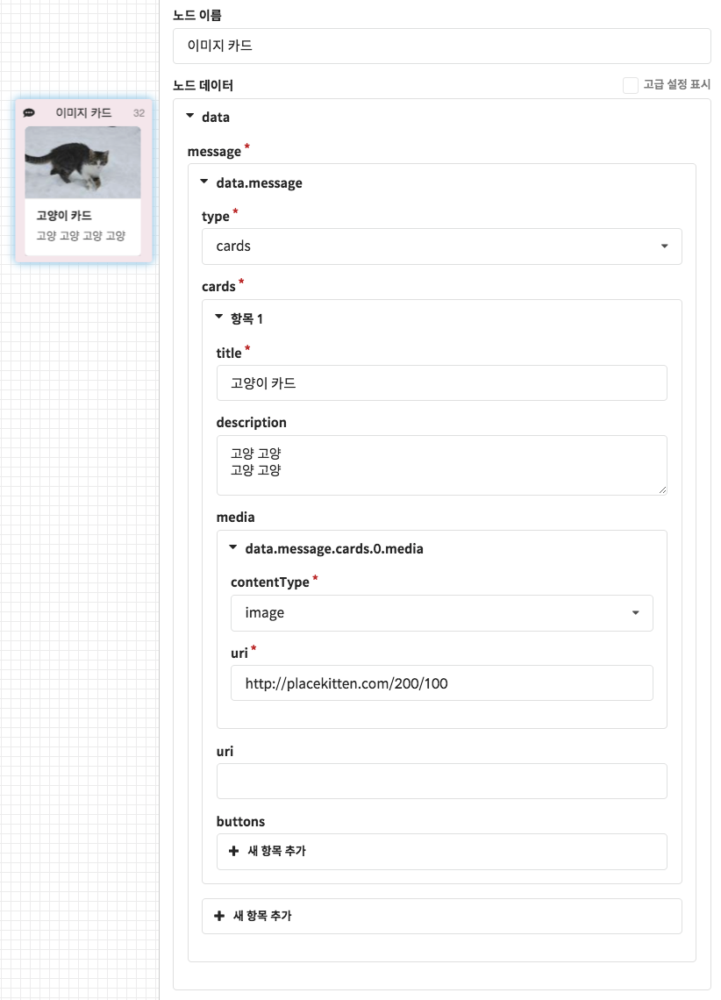
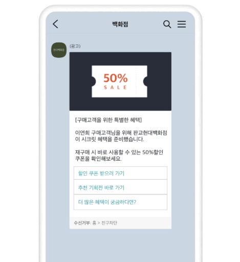
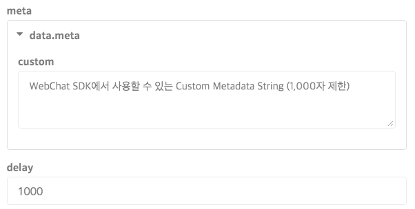
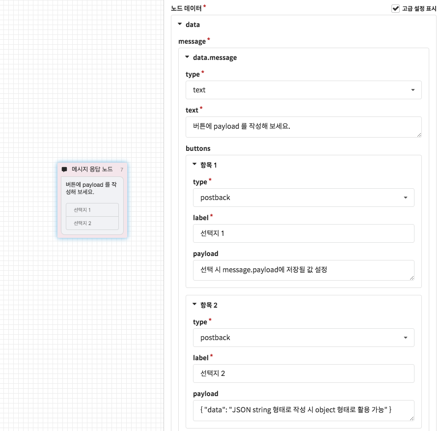

# 메시지 응답 노드

챗봇이 고객에게 전송하는 메시지를 설정할 수 있는 노드 입니다.

CLOSER에서는 최대한 많은 메시징 채널에서 호환성을 갖기 위하여, 각 메시징 채널에서 공통적으로 지원하는 메시지 유형들 중에서 사용 빈도가 높은 다음 네 가지 유형들을 골라 기능을 선택적으로 제공하고 있습니다.

* 텍스트 응답 방식
* 미디어 응답 방식 \(이미지, 동영상, 오디오\)
* 카드형 응답 방식 \(캐러셀\)
* 위치 응답 방식 

각 유형별 메시지 설정 방법은 아래 기본 설정 항목을 참고해 주세요.


메시징 채널마다 설정된 길이 제한이나 기능 지원 여부가 제각각 다르기 때문에,   
CLOSER에서 설정한 값이 연동한 메시징 채널에 제대로 표시되지 않을 수 있습니다.   
이 때, 아래 사항에 적용된 것은 아닌지 확인해주세요. 

* **길이 제한을 초과한 경우**: 초과한 텍스트는 말줄임표\(`...`\)로 대체됩니다. 
* **지원하지 않는 위젯의 경우**: 해당 위젯이 표시되지 않습니다. \(예: 말풍선 버튼\)
* **카드의 갯수나 버튼 갯수를 초과한 경우**: 초과한 항목들은 생략되거나, 가능한 경우 메시지를 나누어서 전송합니다.
* **지원하지 않는 미디어 유형의 경우**: 지원하지 않는 미디어라고 표시되거나 웹 링크로 대체됩니다.

각 메시징 채널 별 지원 여부에 대해서는 [메신저 연동 &gt; 지원 여부 테이블](../../messenger-integrations/#availability-table) 문서를 확인해주세요.


## 전송 가능한 메시지 유형

### 텍스트 메시지 \(text\)

텍스트 응답 방식은 모든 메시징 채널에서 지원하는 가장 기본적인 **말풍선 텍스트** 응답 방식입니다.  
위 예시 화면에서는 템플릿 엔진을 활용하고 있습니다. 이에 대한 자세한 내용은 [템플릿 문법](../advanced/template-syntax.md) 항목을 참고해 주세요.

* **`type`**: `text`
* **`text`**: 1,000자 제한 
* **`buttons`**: 말풍선에 삽입될 버튼
  * `link` 형식: 클릭 시 지정한 url로 이동
  * `postback` 형식: 클릭 시 고객이 버튼 내용을 텍스트를 전송 


postback button 사용 시 존재하는 payload 설정은 하단의 [Postback payload](response.md#postback-payload) 항목에서 더 알아보세요.


### 멀티미디어 메시지 \(media\)

미디어 응답 방식에서는 사진, 동영상 및 음성 형태의 데이터 전송을 지원합니다.   
현재는 다른 서비스를 통해 업로드된 미디어의 URL을 입력해야 되지만, 곧 자체 업로드 기능또한 제공할 예정입니다.

* **`type`**: `media`
* **`media.contentType`**: `image`, `video`, `audio`
* **`media.uri`**: 미디어 파일 주소 


메시징 채널마다 지원하는 미디어의 압축 형식, 크기 제한 등이 각각 상이합니다.    
설정한 미디어 응답을 지원하지 않는 메시징 채널에서는 단순 링크로 대체되거나 \(지원하지 않는 미디어\) 시스템 오류 메시지가 출력됩니다.


### 카드 메시지 \(card\)

카드 메시지는 흔히 캐러셀 \(Carousel\) 이라고 불리는, 설정한 카드들이 가로로 쭉 펼쳐지는 형태의 메시지로 표현됩니다.  
만약 캐러셀을 지원하지 않는 메신저라면 단일 카드를 여러장 전송하게 되며, 카드 형태의 메시지를 지원하지 않는 메신저에서는 이미지와 텍스트를 분리하여 전송하게 됩니다.

카드에는 카드에 사용될 **썸네일**\(작은 이미지\)이나 **카드에 포함될 버튼** 등을 정의할 수 있으며, 한 메시지당 최대 9개의 카드를 설정할 수 있습니다.

* `type`: `cards`
* `cards`: 카드의 배열, 최대 9개까지 추가 가능\) 
  * `title`: 카드의 제목
  * `description`: 카드 내용
  * `media`: 카드 썸네일로 사용될 미디어, [미디어 응답 방식](response.md#undefined-1)에서 사용되는 데이터와 동일
  * `uri`: 카드 클릭 시 이동할 링크 주소 \(공란으로 설정 시 사용하지 않음\)
  * `buttons`: 카드 내부에 삽입될 말풍선 버튼 \(최대 3개\), [텍스트 응답 방식](response.md#undefined)에서 사용되는 데이터와 동일

### 위치 메시지 \(location\) 👩🏻‍🔬

위치 응답 방식에서는 설정한 좌표\(위도, 경도\)를 표시하는 지도 형식의 말풍선을 반환합니다.   
자체적으로 지도를 지원하는 메신저의 경우는 해당 지도의 좌표를, 그 외에는 구글 지도 링크로 대체됩니다.

* `type`: `location`
* `location`: 표시할 위치의 위도/경도 좌표값
  * `latitude`: 위도
  * `longitude`: 경도
  * `title`: 위치\(장소\)의 이름

## 고급 기능

### 커스텀 메타데이터 👩🏻‍🔬

여기서는  체크박스를 활성했을 때 공통으로 표시되는 설정에 대해서 다루도록 하겠습니다.

* `meta.custom`
  * CLOSER SDK를 이용하여 Custom UI를 구현하시는 경우 여기에 사용자 정의 데이터를 설정하실 수 있습니다. 여기서 설정된 값은 `message.meta.custom` 을 통해 획득할 수 있습니다. \(최대 1,000자.\)
* `delay`

  * 메시지가 한 번에 전송되는 것을 원치 않은 경우, 메시지 사이에 임의의 지연 시간을 설정할 수 있습니다. \(단위: milliseconds\) 위 스크린샷의 경우에는 1초\(1,000 밀리초\) 뒤에 메시지를 전송합니다. 

### 포스트백 페이로드 \(Postback Payload\)

를 활성화한 경우 텍스트형 메시지나 카드형 메시지의 postback 버튼에 payload값을 설정할 수 있게 됩니다. 이 기능은 쉽게 이해하기는 어렵지만, **자연스러운 챗봇을 제작하는 핵심 기능**에 해당하니 한번 쯤 읽어보시는 것을 권해드립니다. 



### 템플릿을 이용한 메시지 생성

앞서 중괄호 \(`{{...}}`\) 를 이용한 텍스트를 발견하고 생소함을 느끼셨나요? 이 기능은 **템플릿 문법**이라고 불리는 기능으로서, 현재 **대화의 맥락\(Context\)**에 존재하는 값을 이용해 다음 메시지를 생성하는 데 사용할 수 있도록 하는 강력한 기능입니다. 이에 대한 자세한 내용은 다음 문서를 참고해 주세요.





