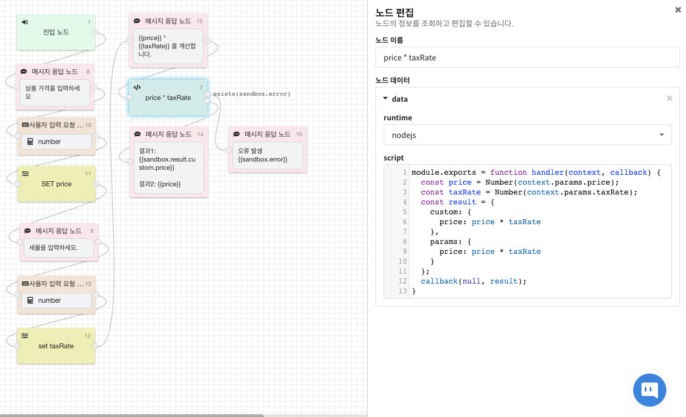
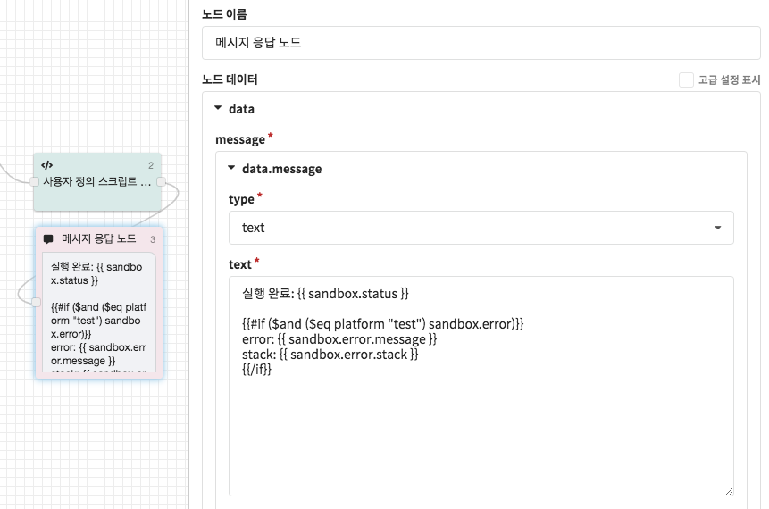
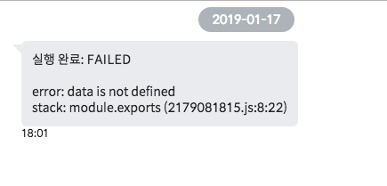

# 사용자 정의 스크립트 노드

## 실행환경

런타임: Node.js v8.10  
타임아웃: `5,000`ms  
코드길이 제한: `50,000`byte  
응답크기 제한: `50,000`byte

만일 실행 과정에서 오류가 발생하거나 수행시간이 5,000ms 를 초과할 경우 스크립트 실행이 종료되며, 이 시점에서 실행 중인 스크립트에 대한 결과는 보장할 수 없습니다. 때문에 제한 시간을 넘지 않도록 주의해 주시고, 오류 발생시 분기가 필요하다면 [3. 오류 처리하기](sandbox.md#3-error-handling) 항목을 참고해 주세요.

## 제공되는 Node.js 라이브러리

| 패키지명 | 버전 |
| :--- | :--- |
| apn | 2.2.0 |
| aws-sdk | 2.389.0 |
| bluebird | 3.5.3 |
| cheerio | 1.0.0-rc.2 |
| crypto | - |
| csv-parse | 4.3.0 |
| fetch | 1.1.0 |
| gm | 1.23.1 |
| googleapis | 36.0.0 |
| iconv-lite | 0.4.24 |
| imagemagick | 0.1.3 |
| lodash | 4.17.11 |
| moment | 2.23.0 |
| moment-timezone | 0.5.23 |
| nodemailer | 5.1.1 |
| request | 2.88.0 |
| request-promise | 4.2.2 |
| superagent | 4.1.0 |
| underscore | 1.9.1 |
| uuid | 3.3.2 |
| xml2js | 0.4.19 |


원하시는 라이브러리를 사용하실 수 없나요?   
사용자 정의 스크립트 노드 대신 NodeJS 프로토타이핑 툴인 RunKit 을 이용해보세요.   
RunKit Endpoint\(베타\)를 이용하면 원하시는 기능을 구현하고 API를 호스팅할 수 있습니다. \(현재 무료\)

* [https://runkit.com/](https://runkit.com/) \(RunKit 공식 홈페이지, 영문\)
* [https://runkit.com/docs/endpoint](https://runkit.com/docs/endpoint) \(RunKit Endpoint 문서, 영문\)


## 핸들러 함수

사용자 정의 스크립트 노드에 작성하는 script는 하나의 Node.js의 모듈과 동일합니다.  
챗봇은 `module.exports` 로 선언된 함수를 실행합니다. callback, Promise 두 가지 형태의 반환 형식을 지원합니다.

### handler\(context, callback\): _void_

#### context _\(Object\)_

챗봇에서 전달 받는 객체

| Property | Type | Description |
| :--- | :--- | :--- |
| bot | [Bot](sandbox.md#type-bot) | 챗봇의 정보 |
| conversationId | String | 진행 중인 대화의 UUID |
| endUserId | String | 진행 중인 대화 고객의 UUID |
| params | Object | 진행 중인 대화 파라미터 딕셔너리 |
| platform | String | 진행 중인 대화의 메시징 플랫폼 타입\(`'kakao', 'kakaobiz', 'facebook', 'line', 'navertalk', 'bizchat', 'wechat', 'web'`\) |
| userKey | String | 메시징 플랫폼에서 제공하는 고객의 고유 Id |
| message | [Message](sandbox.md#type-message) | 고객이 입력한 메시지 |

#### callback\(error, result\) _\(Function\)_

챗봇에 결과를 전달하는 콜백 함수

| Argument | Type | Description |
| :--- | :--- | :--- |
| error | Error | 오류 발생시 전달할 객체 |
| result | [HandlerResult](sandbox.md#type-handler-result) | 스크립트 실행 결과로 전달할 객체 |

**Callback 예시**

```javascript
module.exports = function handler(context, callback) {
  callback(null, {
    params: {
      result: 'Hello CLOSER'
    }
  });
};
```

### handler\(context\): _Promise&lt;HandlerResult&gt;_

Promise형태로 결과값을 반환할 수 있습니다.

**Promise 예시**

```javascript
module.exports = function handler(context) {
  return new Promise((resolve, reject) => {
    resolve({
      params: {
        result: 'Hello CLOSER'
      }
    });
  });
};
```

**Async Function 작성 시**

```javascript
module.exports = async function handler(context) {
  // const somePromise = ...
  // await somePromise;
  return {
    params: {
      result: 'Hello CLOSER'
    }
  };
};
```

### 데이터 타입

#### Bot   <a id="type-bot"></a>

| Property | Type | Description | Required |
| :--- | :--- | :--- | :--- |
| title | String | 봇의 이름 | Y |
| description | String | 봇의 설명 | N |

#### HandlerResult   <a id="type-handler-result"></a>

| Property | Type | Description | Required |
| :--- | :--- | :--- | :--- |
| custom | Object | 이후 노드에서 `sandbox.result.custom`으로 접근할 객체 | N |
| params | Object | 노드 실행 후 설정할 파라미터  \(설정된 키에 대한 값만 덮어씌워집니다.\) | N |

## 예제: 간단한 곱셈 스크립트

### 1. 시나리오 작성 <a id="1-scenario"></a>



위 플로우는 챗봇에서 가격과 세율를 입력 받아 곱한 값을 반환하는 시나리오입니다. 제품의 가격을 사용자 입력 요청노드를 통해 입력받고, 파라미터 설정 노드에서 `price`에 `{{message}}`를 설정합니다. 세율을 사용자 입력 요청노드를 통해 입력받고, 파라미터 설정 노드에서 `taxRate`에 `{{message}}`를 설정합니다.

### 2. 스크립트 작성 <a id="2-script"></a>

```javascript
module.exports = function handler(context, callback) {
  // 파라미터의 타입이 String일 수 있으므로 Number 타입으로 형변환합니다.
  const price = Number(context.params.price);
  const taxRate = Number(context.params.taxRate);
  const result = {
    custom: {
      price: price * taxRate
    },
    params: {
      price: price * taxRate
    }
  };
  callback(null, result);
};
```

앞서 입력받은 파라미터는 사용자 정의 스크립트 노드에서 `context.params`에서 참조할 수 있습니다. `context.params.price`와 `context.params.taxRate`를 곱한 값을 반환합니다.

`custom`에 반환되는 값은 이후 노드에서 `{{sandbox.result.custom}}`으로 참조할 수 있습니다. `params`에 반환되는 값은 이후 노드에서 해당 파라미터의 값을 설정합니다. 예제 스크립트의 경우 `price`파라미터를 새 값으로 덮어 씁니다.

만일 `message`로 `{ text: '가격: ' + price * taxRate }`을 반환하면 챗봇은 사용자 정의 스크립트 노드가 종료되는 시점에 `text`에 해당하는 String을 최종 사용자에게 메시지로 전달합니다. 메시지 객체의 타입은 추후 변경될 수 있으니 가급적 추가적으로 메시지 응답 노드를 생성하여 [템플릿 문법](../advanced/template-syntax.md)을 활용하는 것을 추천합니다.

### 3. 오류 처리하기 <a id="3-error-handling"></a>

#### 오류 발생 시 분기 <a id="3-error-handling-conditional-branching"></a>

사용자 정의 스크립트 노드에서 오류가 발생할 경우 챗봇은 아무런 메시지를 반환하지 않습니다만, `sandbox.error`를 통해 오류가 발생하였을 경우의 시나리오를 처리할 수 있습니다. \(사용자 정의 스크립트 노드의 엣지로 `sandbox.error`**가 존재하는 경우**로 챗봇 로직을 분기할 수 있습니다.\)

#### 오류 디버깅 <a id="3-error-handling-debug"></a>

`sandbox.error`객체는 스크립트에서 반환하는 오류 또는 스크립트 실행 도중 발생한 오류로서, `{{sandbox.error.message}}` 혹은 `{{sandbox.error.stack}}` 값을 통해 디버깅 할 수 있습니다.  
다만 디버깅 메시지를 사용할 때, 챗봇과 대화하는 최종 사용자에게 해당 메시지가 그대로 노출되지 않도록 유의하세요.

아래는 **대화 테스트**\(platform: `test`\)일 때에 오류가 존재하면 오류의 정보를 출력하는 디버깅 방법의 예시입니다.





위 예시의 오류 호출 스택 \(stacktrace\) 을 살펴보면 작성한 스크립트의 8번째 줄 22 번째 위치에서 오류가 발생했음을 확인할 수 있습니다. 이를 응용하여 스크립트의 오류를 디버깅 해 보세요.


  


