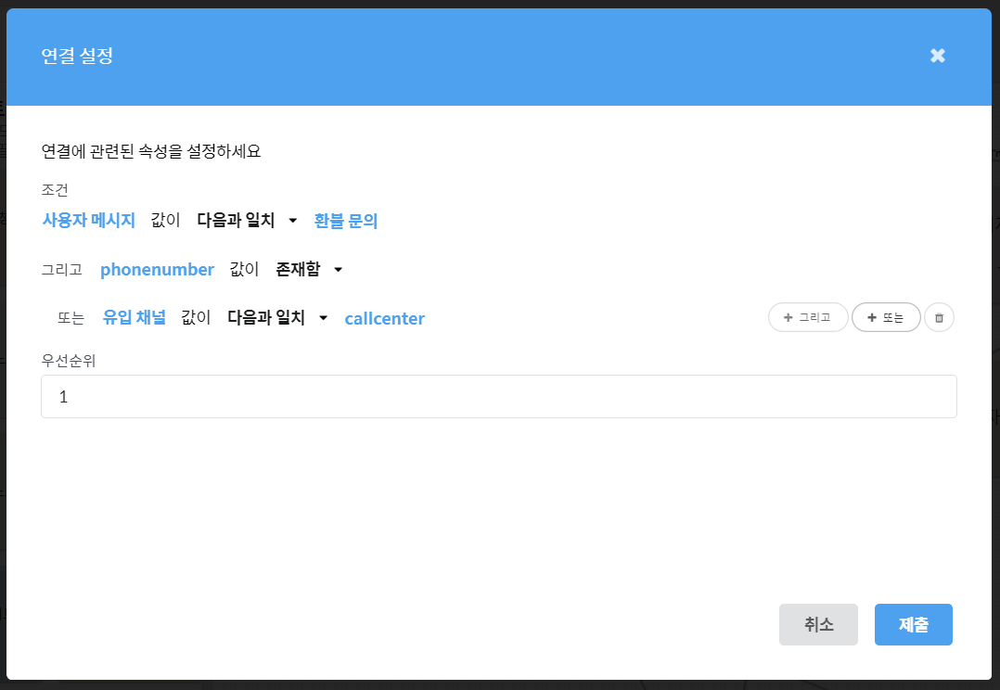

# 엣지\(Edge\)

노드와 노드를 이어 대화 흐름을 설정합니다.  
한 노드의 기능을 수행한 뒤 다음 노드로 이동하는 분기 조건을 엣지에 설정할 수 있습니다.

## 노드와 노드 연결하기 

노드 오른쪽의 joint를 드래그 해 다른 노드와 연결할 수 있습니다.

* Entry Node에서 시작해 연결된 노드가 순차적으로 실행되며, 사용자 입력 요청 노드에 진입하면 사용자의 입력을 대기합니다.
* 메시지 응답 기능을 가진 노드\(Entry Node, 메시지 응답 노드, 상담원 호출 노드 등\)를 여러개 연달아 연결할 경우 각각의 메시지를 연달아 발송합니다. 이를 지원하지 않는 메신저\(카카오톡 자동응답API\)의 경우 각각의 메시지가 아닌 하나의 메시지로 합쳐져서 발송됩니다.

## 연결 설정 

생성된 엣지를 더블클릭하면 설정 창이 열립니다. 진입할 다음 노드를 결정하는 조건을 설정할 수 있습니다.

### 우선순위 

* 여러 엣지가 조건을 충족한다면 우선순위가 높은 곳으로 분기됩니다. \(숫자가 높을수록 우선순위가 높습니다.\)
* 아무값도 입력하지 않을 시 기본값은 1입니다.
* 최대값은 정수의 최대값입니다 \(2017.11.06 기준\)

### 조건 

* 해당 엣지로 분기되도록 각종 조건문을 설정할 수 있습니다.
* 특정 파라미터 값에 대한 비교를 수행해 일치할경우 진행합니다.
* 조건에 대한 파라미터는 사용자 메시지, 사용자 식별 키, 유입 채널, \(자연어\) 발화 의도, \(자연어\) 개체명, \(자연어\) 언어, 파라미터 등으로 설정할 수 있습니다.
* 조건 중 하나를 선택할 수 있습니다. \(일치 / 일치하지 않음 / 다음을 포함 / 다음 값 중 하나 / 다음 값을 포함하지 않음 / 보다 작음 / 보다 작거나 같음 / 보다 큼 / 보다 크거나 같음 / 존재함 / 존재하지 않음 / 정규표현식 등\)
* 조건을 선택한 후에는 파라미터와 비교할 값을 입력합니다. 배열 안에 여러 값을 입력할 수 있습니다.

### 조건 사용 예시 

아래 예시처럼 여러 조건을 한 번에 걸 수도 있습니다. 아래 예시는 사용자 메시지 값이 환불 문의와 일치하고, 전화번호 \(phonenumber\)가 존재하거나 유입 채널이 콜센터일 때 분기해서 다음 노드로 넘어가는 조건입니다.

