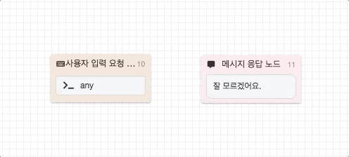
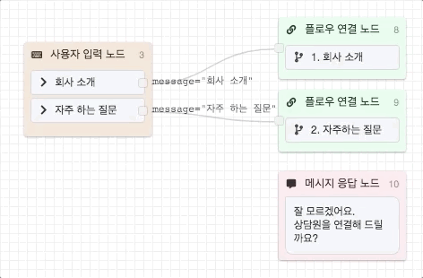
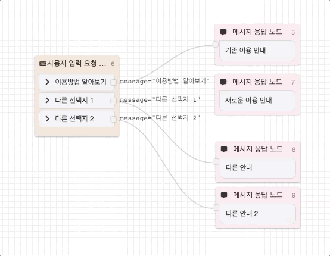
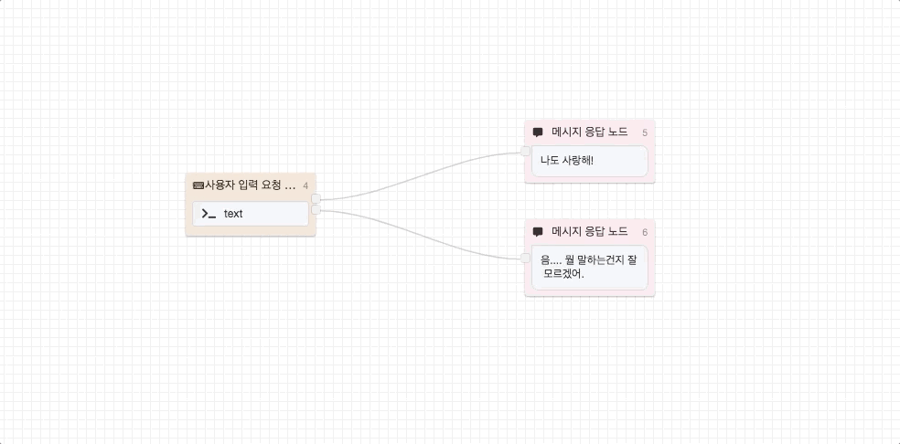
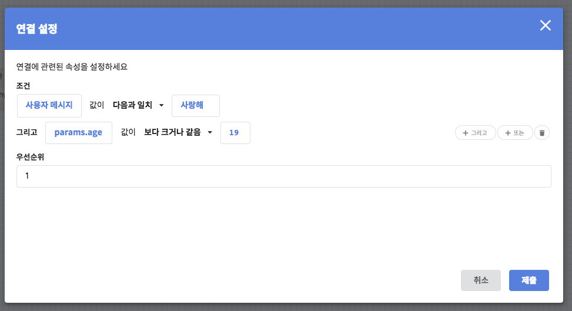

# 노드 연결하기

## 노드 연결하기 

이전 문서에서는 CLOSER 챗봇의 기능 수행 단위인 [노드\(Node\)](node/) 에 대하여 알아보았습니다.   
여기서는 챗봇을 의도한대로 제작하기 위해 노드와 노드를 연결하여 챗봇의 시나리오를 설계하는 법을 알아봅니다.

### 새로운 연결 생성하기 

노드에 마우스 커서를 가져다 대시리면 해당 노드 오른쪽에 **하늘색 삼각형 도형**이 표시됩니다. 이 때 해당 도형 위에서  마우스 왼쪽 버튼을 누르시면 **새로운 연결 선**이 생성 되고, 연결할 노드 위에 가져다 놓으시면 두 노드가 서로 연결됩니다. \(Drag & Drop\)

선택지형 입력 노드는 사용자 편의를 위해 조금 특별 기능을 제공합니다. 자세한 내용은 아래를 확인해주세.  

선택지형 입력 노드에서는 **해당 선택지를 입력했을 때** 연결될 노드의 조건을 직접 작성할 필요 없이, 해당 선택지 위에 마우스 커서를 올리면 앞서 서술한 것보다 **더 작은 하늘색 삼각형 도형**이 표시됩니다. 이 때 해당 영역에서 노드를 연결할 때 처럼 마우스 왼쪽 버튼을 누른 채 연결할 노드에 가져다 놓으시면 **조건이 자동으로 작성되어 연결**됩니다.

만일 선택지 외의 입력 값에 대해 노드를 연결하고 싶으신 경우, 선택지 영역 밖으로 마우스 커서를 가져다 대시면 다시 기존에 보았던 **크기가 다른 삼각형 도형**을 확인하실 수 있습니다. 이를 이용하여 조건을 만족하지 못할 때 이동하게 될  노드를 지정할 수 있습니다. 

### 기존 연결 변경하기 

챗봇 시나리오를 변경하려는 경우, 기존 연결을 새로운 노드로 이동하여야 하는 상황이 발생합니다.   
이 때, 연결과 연결 사이에 있는 연결점\(Joint\)을 끌어서 새로운 노드로 이동시킨다면 기존 연결을 다른 노드로 손쉽게 이동시킬 수 있습니다. 연결점을 끌어 새로 연결할 노드가 아닌 캔버스 위에 놓는 방식으로 기존 연결을 제거할수도 있습니다. 


실수로 연결을 제거하셨나요? 걱정하지 마세요! 실행 취소 \(Ctrl + Z\) 기능을 사용하실 수 있답니다 🤗


## 연결에 조건 설정하기   

챗봇 시나리오를 작성할 때, 한 노드에서 조건에 따라 다양한 노드로 분기하여야 하는 경우가 종종 발생합니다.   
이 때, 노드와 노드 사이의 연결에 필요한 조건과 그 우선순위를 설정하여 흐름을 제어할 수 있습니다.

### 조건 

조건은 주로 **사용자 메시지\(message.text\)** 값을 이용하게 됩니다. 하지만 이전 선택지와 바로 연결된 경우가 아닌 경우에는 [파라미터\(Parameter\) ](parameter.md) 기능을 적극 활용할 수 있습니다. 다음은 사용자의 나이를 age에 입력받았다고 가정하였을 때, 특정 플로우에 진입했을 때 19세 미만은 이용할 수 없다는 안내 메시지를 출력하기 위한 조건을 나타냅니다.

연결 조건에는 **그리고\(AND\)** 및 **또는\(OR\)** 결합 조건을 통해 하나 이상의 속성을 기준으로 조건을 설정하는 것이 가능합니다. 조건 항목 위에 마우스 커서를 가져다 대시면 우측에 +**그리고 버튼**과 +**또는 버튼**을 확인하실 수 있는데요, 이 버튼을 눌러 결합 조건을 추가하거나 **휴지통 버튼**을 눌러 조건을 제거하실 수 있습니다.

### 우선순위   

하나의 노드는 하나의 노드로만 진행됩니다. 하지만 하나의 노드에서 연결된 노드들에서 동시에 여러 가지 조건을 만족한다면, 설정된 우선순위 값에 따라 다음으로 진행할 노드를 결정하게 됩니다. 


조건을 만족하는 노드들이 모두 같은 우선순위를 갖는 경우에는 **결합 조건이 더 많이 설정된 연결을 우선**하여 선택됩니다. 우선순위와 조건의 수가 모두 같은 경우에는 **동작의 일관성을 보장할 수 없기 때문에**, ****이러한 경우 ****우선순위 설정을 잘 확인해주세요.


