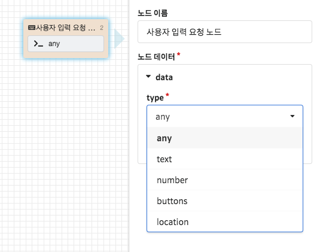
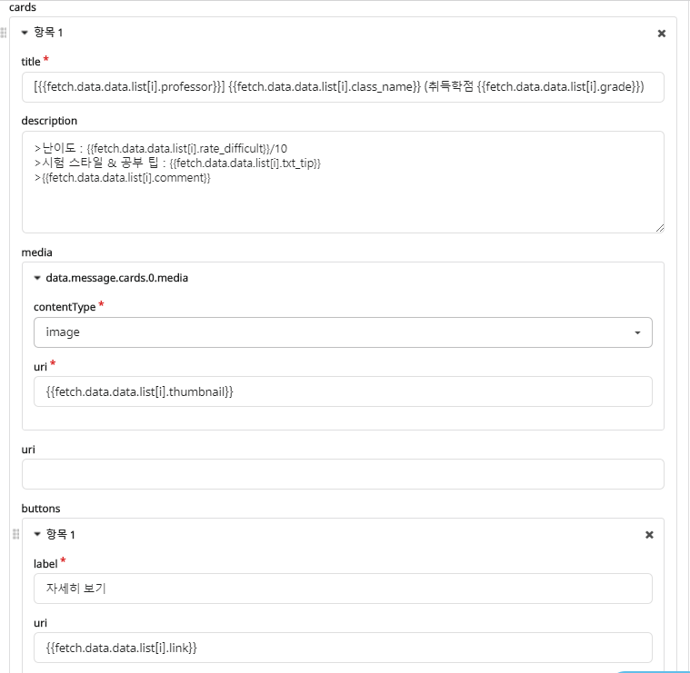
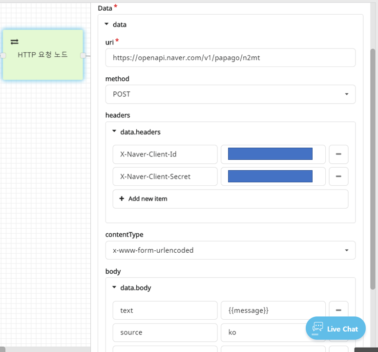
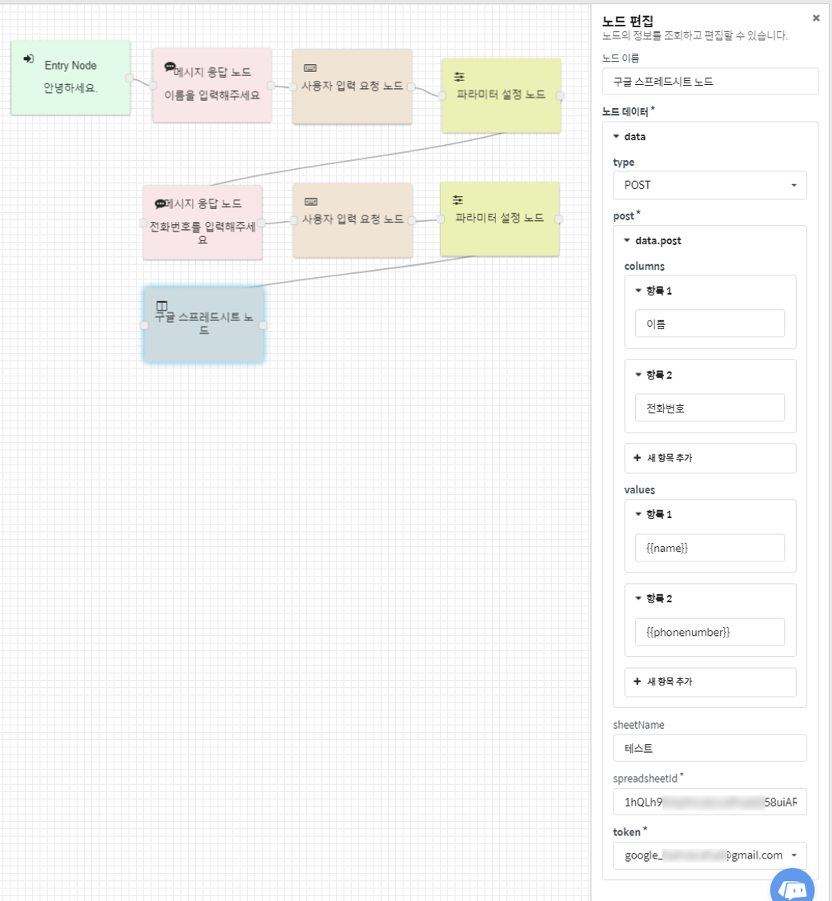

# 노드\(Node\)

노드는 CLOSER에서 챗봇을 설계하기 위한 가장 기본 구성 요소입니다.  
제공되는 다양한 기능별 노드들을 연결해 대화를 구성할 수 있습니다.

## 캔버스에 새로운 노드 추가하기 

팔레트에서 원하는 노드를 골라 캔버스에 끌어다 놓으면\(drag&drop\) 노드가 추가 됩니다.

## 공통사항 

캔버스 위의 노드를 더블클릭하면 내용을 수정할 수 있는 패널이 우측에 열립니다.  
노드 삭제는 delete나 backspace, 혹은 마우스 우클릭 - 삭제를 클릭하면 할 수 있습니다.  
노드 복사, 잘라내기 기능은 마우스 우클릭에서 사용할 수 있습니다.

## 노드 팔레트 

아래와 같은 기능별 노드를 제공합니다.

### **시작 노드 \(Entry Node\)**

* 모든 플로우에 존재하는 시작 노드로, 대화의 시작지점입니다.
* 대화를 시작하기 위한 메시지를 원하는 대로 설정할 수 있습니다.

### **사용자 입력 요청 노드\(User Input Node\)**

* 사용자로부터 입력을 받기 위한 노드 입니다
* 입력 유형은 텍스트\(text\), 숫자\(number\), 버튼\(buttons\), 위치\(location\) 중에서 선택할 수 있습니다.
* 텍스트\(text\)를 선택할 경우 사용자에게 문자를 입력받을 수 있습니다.
* 숫자\(number\)를 선택할 경우 최소값\(min\)과 최대값\(max\)를 설정할 수 있습니다.
* 버튼\(buttons\)을 선택할 경우 원하는 버튼명\(label\)의 버튼을 생성할 수 있습니다.
  * strict를 설정할 경우 버튼을 누르는 것 이외의 동작이 실행될 경우 오류 메시지를 표시합니다. 오류 메시지는 수정 가능합니다. \("아래 옵션 중 선택해 주세요." 등의 메시지 발송 가능\)
  * strict를 해제했을 경우 버튼 이외의 값이 허용됩니다. 버튼 옵션을 제공하지만 자연어 입력도 허용하고 싶은 경우 사용합니다. 이 경우 로직을 설계해 버튼을 누르지 않고 자연어를 입력했을 때 어떻게 동작할 지 설정해야 합니다.
  * 각 버튼을 눌렀을때 파라미터에 특정 값이 입력되도록 params 항목을 설정할 수 있습니다. 사용자가 입력한 값은 파라미터에 저장되고 다음 노드로 진입합니다. \(파라미터 설정 노드 참고\)
* 위치\(location\)를 선택할 경우 사용자의 위치를 입력받을 수 있습니다.

### **메시지 응답 노드\(Response Node\)**

* 챗봇이 사용자에게 전송하는 메시지를 설정하는 노드 입니다.
* 메시지의 텍스트\(text\), 이미지\(media\), 메시지 하단 url링크 버튼\(button\) 등을 설정할 수 있습니다.
* 아래는 각각의 메시지 예시 입니다.

* 적어도 한가지 형태의 메시지는 반드시 설정해야 합니다.
* 카드\(cards\)항목을 이용하면 카드형 응답을보낼수있습니다.
* 메신저별로 제공하는UI로 변환되어 전송되며, 카드형 응답을 제공하지 않는 메신저\(카카오톡 자동응답API, 카카오상담톡\)의 경우에는 하나의 메시지로 합쳐져 발송됩니다.
* HTTP Request를 통해 받아온 배열의 크기에 따라 동적으로 카드가 생성되도록 구현할 수도 있습니다.
* 아래 이미지를 참고해 주세요.

> 카카오 상담톡 이미지 권장사항
>
> • 이미지 타입 \(CLOSER의 메시지 응답노드의 media &gt; image 에 해당\) 최대 5mb jpg, png, gif
>
> • Link Button 타입 \(CLOSER의 메시지 응답노드의 card에 삽입된 이미지에 해당\) 권장 720x720 최소 500x500, 2:1 비율 이상, 3:4 비율 이하 0.5mb 이하 jpg, png
>
> 현재로서는 카카오 상담톡 규격에 벗어난 이미지 혹은 카카오 상담톡에서 지원하지 않는 타입의 미디어가 있다면 \(지원하지 않는 미디어\) 라는 메시지로 대치될 것입니다.

### **플로우 연결 노드** 

* 원하는 플로우로 이동해 대화를 이어나가도록 설정하는 노드 입니다.
* 플로우 연결 노드를 캔버스에 끌어다 놓은 후 현재 생성된 플로우의 목록 중 하나를 선택하면 설정됩니다.
* 설계해 놓은 시나리오가 완전히 끝날 경우 플로우의 마지막은 플로우 연결 노드로 끝나고 엔트리 플로우로 연결되어 처음으로 돌아갈 때 가장 자연스럽습니다. 플로우의 마지막이 다른 노드로 끝날 경우 오류 메시지가 나타납니다. 플로우끼리 계속 연결해 놓는 것을 권장합니다.

### **HTTP요청 노드\(HTTP Fetch Node\)**

* 외부 API와 연동하기 위해 사용하는 노드 입니다.
* 원하는 URL로 GET, POST, DELETE, PUT요청을 보낼 수 있습니다.
* 필요에 따라 header와 body값을 설정할 수 있습니다.
* 목적지 url의 서버에서 반환한 값은 `fetch` 파라미터에 객체 타입으로 저장됩니다.

#### fetch _(object)_
HTTP요청 노드 진행 후 생성되는 객체입니다.

| 파라미터 | 타입 | 설명 |
| :--- | :--- | :--- |
| data       | object | 서버에서 반환한 결과 값 오브젝트 |
| error      | Error  | 요청의 결과로 도착한 오류 혹은 요청시 오류 |
| status     | string | 성공시 'COMPLETED', 실패시 'FAILED' |
| statusCode | number | 서버에서 반환한 statusCode \(200, 401 등\) |
| uri        | strng  | 요청 URI |

* 응답 받은 데이터는 `{{fetch.data}}`와 같이 참조할 수 있으며,
  JSON타입인 경우 `{{fetch.data.path[2].your.object}}`와 같이 접근이 가능합니다.

* 아래는 네이버가 제공하는 파파고 영어번역API 연동 예시입니다.

### **파라미터 설정 노드** 

* 대화하는 도중에 사용자로부터 입력받거나 서버에서 받아온 값을 파라미터로 저장할 수 있는 노드 입니다.
* 사용자가 입력한 값 저장, HTTP 요청으로 서버에서 받아온 값 설정, 현재 상황에 따른 변수 값 변경 등의 목적으로 사용합니다.
* 파라미터 값 설정\(set\), 해제\(clear\)가 가능합니다.
* 파라미터 값은 string으로 저장되며, JSON object값 입력은 현재는 가능하지만 비활성예정입니다.
* 아래는 사용자가 입력한 메시지\(이름\)을 name이라는 파라미터에 저장하는 예시입니다. 이렇게 이름 파라미터를 설정한 후에는  형태로 입력받은 이름을 사용할 수 있습니다. 예\) "님 안녕하세요. 무엇을 도와드릴까요?" 형식으로 파라미터로 저장 되어있는 이름을 사용할 수 있습니다.
* CLOSER Chat에서 노출되는 지정된 파라미터를 "chat:파라미터명"으로 설정할 수 있습니다.

| 파라미터명 | 설명 |
| :--- | :--- |
| chat:displayName | 이름 |
| chat:phoneNumber | 전화번호 |
| chat:email | 이메일 |
| chat:category:0 | 대분류 |
| chat:category:1 | 중분류 |
| chat:category:2 | 소분류 |

### **구글 스프레드시트 노드** 

* 사용자가 입력한 정보를 구글 스프레드 시트에 기록하고 저장하기 위해 사용하는 노드 입니다.
* 환경설정 &gt; 연결관리 메뉴에서 구글 계정을 연동한 경우에 사용 가능합니다.
* 시트명, 컬럼명, 값을 입력해두면 사용자가 입력한 값이 시트에 실시간으로 입력됩니다.
* 일치하는 시트명\(sheetName\)이 없으면 새로운 시트를 생성합니다.
* 새로운 시트를 생성할때는 Columns 항목의 이름을 첫 행에 입력합니다.
* 이미 존재하는 sheet에 입력할 경우에는 column 명칭에 상관 없이 빈 행부터 차례로 값을 채웁니다.
* spreadsheetId는 스프레스 시트 URL에서 아래 표시된 부분 입니다.

* 아래는 사용자가 입력한 메시지를 파라미터로 저장하여 시트에 입력받는 예시 입니다. 아래와 같이 입력할 경우 사용자가 입력한 이름 값은  파라미터에 저장되어 이름 열에, 전화번호 값은  파라미터에 저장되어 전화번호 열에 기록됩니다.

### **상담원 호출 노드** 

* CLOSER Chat이나 다른 Live Chat 솔루션과 연동한 경우 상담원을 호출하는 노드 입니다.
* 해당 노드에 진입하면 안내메시지를 출력한 뒤 상담원을 호출하는 webhook이 전송됩니다.
* 상담원이 호출될때까지 봇의 동작은 중지되고, 사용자의 입력에 반응하지 않습니다.
* 상담원이 호출된 상태에서 상담원이 응답하기 전에 사용자가 "취소" 라고 입력하면 상담원 호출이 취소되고, 다시 봇 모드로 전환되어 연결된 다음 노드로 진행합니다.

### **자연어 처리 노드** 

* 사용자의 입력에 따라 인공지능 기반 대화를 구현하기 위해 사용하는 노드입니다.
* CLOSER는 자체 인공지능 엔진은 제공하지 않지만 외부 자연어 서비스를 연동할 수 있습니다.
* 자동응답, 의도 및 개체 식별 기능을 제공합니다.
* API.ai\(Dialogue Flow\), Watson Conversation 과 연동 가능합니다.
* 반환 값은 아래와 같이 nlp 파라미터 안에 저장됩니다.

| 파라미터 | 자료형 | 설명 |
| :--- | :--- | :--- |
| nlp.intent | string | 의도 |
| nlp.entities | \[{entity: string, value: string, score: number}\] | 개체 |
| nlp.answer | string | 자동응답 답변 |
| nlp.score | number | 자동응답 정확도 |

### 뒤로가기 스택 노드 

챗봇에서 이전 단계의 선택지로 돌아가도록 뒤로가기 스택 노드로 구성할 수 있습니다.  
챗봇을 구성하는데 전 단계로 이동할 포인트를 찍고 이전에 찍었던 포인트로 이동하는 기능입니다.

#### PUSH

* 이전 단계로 이동할 포인트를 찍습니다.
* 메시지 응답 노드 앞에 두어야 선택지에 대한 설명과 함께 표시됩니다.

#### POP

* PUSH에서 찍은 단계로 이동합니다.
* Count로 몇번째 앞으로 이동할지 설정합니다.

#### CLEAR

* PUSH로 설정했던 모든 포인트를 제거합니다.

#### 뒤로가기 스택 노드 사용 예시 

* 위와 같이 뒤로가기 스택 노드를 구성하면 **두번째 선택지**에서 **'이전 단계로 가기**' 버튼을 누르면 **첫번째 선택지**로 **이동**합니다.
* **두번째 선택지**에서 **이전 단계로 가기**를 선택했을 때 뒤로가기 스택 노드로 이동하는데, 이때 **Operation**은 **pop**, **count**는 **2**로 설정되어있습니다.
* **count**를 **1**로 설정한 경우 첫번째 선택지가 아니라 두번째 선택지로 이동하게 됩니다.

