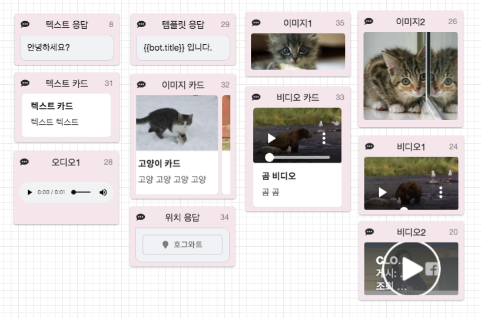
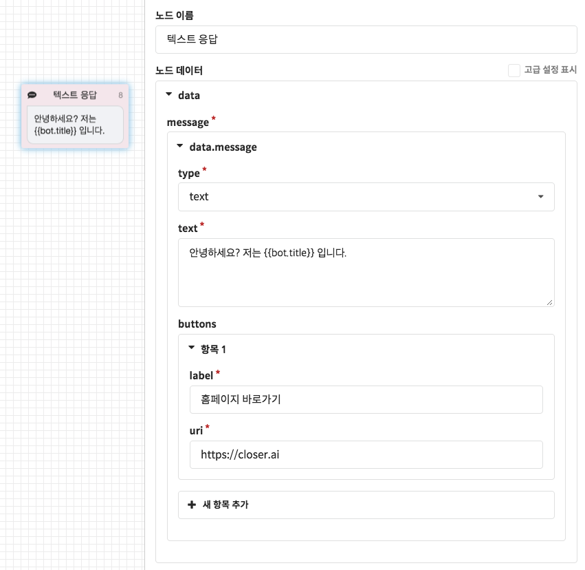
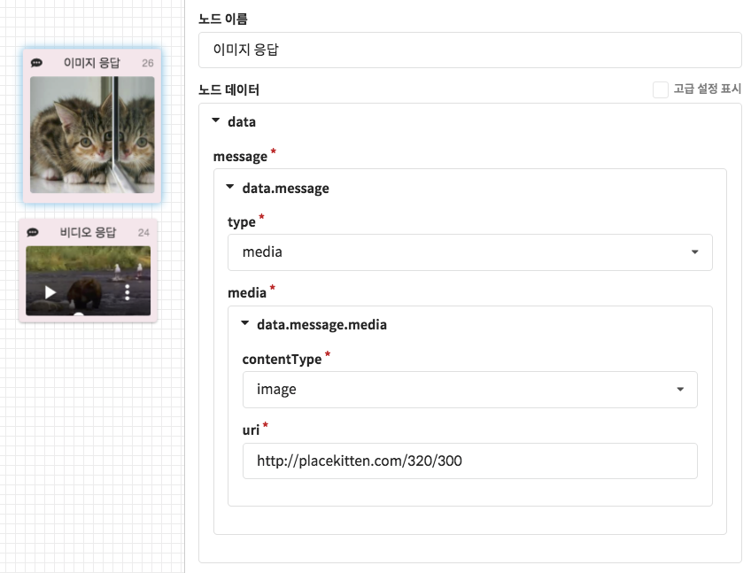
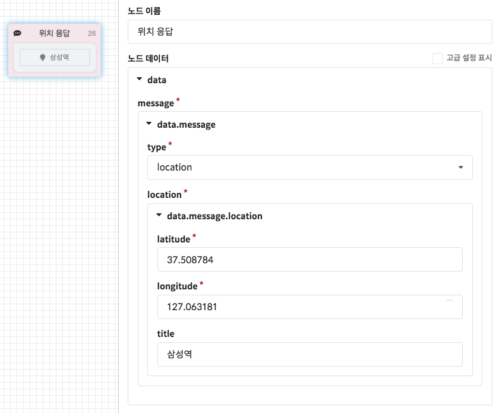

# 메시지 응답 노드

챗봇이 고객에게 전송하는 메시지를 설정할 수 있는 노드 입니다.

CLOSER에서는 최대한 많은 메시징 채널에서 호환성을 갖기 위하여, 각 메시징 채널에서 공통적으로 지원하는 메시지 유형들 중에서 사용 빈도가 높은 다음 네 가지 유형들을 골라 기능을 선택적으로 제공하고 있습니다.

* 텍스트 응답 방식
* 미디어 응답 방식 \(이미지, 동영상, 오디오\)
* 카드형 응답 방식 \(캐러셀\)
* 위치 응답 방식 

각 유형별 메시지 설정 방법은 아래 기본 설정 항목을 참고해 주세요.

## 기본 설정

### 텍스트 응답 방식

텍스트 응답 방식은 모든 메시징 채널에서 지원하는 가장 기본적인 **말풍선 텍스트** 응답 방식입니다.  
위 예시 화면에서는 템플릿 엔진을 활용하고 있습니다. 이에 대한 자세한 내용은 [템플릿 문법](../template-syntax.md) 항목을 참고해 주세요.

* **`type`**: `text`
* **`text`**: 1,000자 제한 
* **`buttons`**: 말풍선에 삽입될 버튼, 최대 3개. \(현재 웹 링크 형식만 지원합니다.\)


메시징 채널 별로 설정된 길이 제한이 상이합니다.   
만일 1,000자 이하로 작성한 경우에도 메시징 채널에서 설정된 길이 제한을 초과한 경우, 초과한 텍스트는 말줄임표\(`...`\)로 대체됩니다


### 미디어 응답 방식

미디어 응답 방식에서는 사진, 동영상 및 음성 형태의 데이터 전송을 지원합니다. 현재는 다른 서비스를 통해 업로드된 미디어의 URL을 입력해야 되지만, 곧 자체 업로드 기능또한 제공할 예정입니다.

* **`type`**: `media`
* **`media.contentType`**: `image`, `video`, `audio`
* **`media.uri`**: 미디어 파일 주소 


각 메시징 채널마다 지원하는 미디어의 압축 형식, 크기 제한 등이 상이합니다.    
설정한 미디어 응답을 지원하지 않는 메시징 채널에서는 단순 링크로 대체되거나 \(지원하지 않는 미디어\) 시스템 오류 메시지가 출력됩니다.


### 카드 응답 방식

카드형 응답 방식은 흔히 캐러셀 \(Carousel\) 이라고 부르는 응답 방식으로, 한 메시지에서 가로로 스크롤이 가능한 카드들을 포함한 메시지 형태를 의미합니다.

카드에는 카드 썸네일이나 클릭시 링크, 카드에 포함될 버튼 등을 정의할 수 있으며, 한 메시지당 최대 9개의 카드를 설정할 수 있습니다.

* `type`: `cards`
* `cards`: 카드의 배열, 최대 9개까지 추가 가능\) 
  * `title`: 카드의 제목
  * `description`: 카드 내용
  * `media`: 카드 썸네일로 사용될 미디어, [미디어 응답 방식](response.md#undefined-1)에서 사용되는 데이터와 동일
  * `uri`: 카드 클릭 시 이동할 링크 주소 \(공란으로 설정 시 링크 사용하지 않음\)
  * `buttons`: 카드 내부에 삽입될 말풍선 버튼 \(최대 3개\), [텍스트 응답 방식](response.md#undefined)에서 사용되는 데이터와 동일


메시징 채널 별로 카드형 메시지 \(Carousel\) 응답의 지원 여부가 상이합니다.

설정한 메시징 채널에서 카드형 메시지를 지원하지 않는 경우 카드의 내용이 하나의 말풍선에 표시되거나, 여러 개의 말풍선으로 구분되어여 표시될 수 있습니다.


### 위치 응답 방식

위치 응답 방식에서는 설정한 좌표 \(위도, 경도\)를 표시하는 지도 형식의 말풍선을 반환합니다.   
자체적으로 지도를 지원하는 메신저의 경우는 해당 지도의 좌표를, 그 외에는 구글 지도 링크로 대체됩니다..

* `type`: `location`
* `location`: 표시할 위치의 위도/경도 좌표값
  * `latitude`: 위도
  * `longitude`: 경도
  * `title`: 위치\(장소\)의 이름


메시징 채널 별로 위치 메시지의 응답 여부가 상이합니다.

만일 지원하지 않는 메시징 채널일 경우 구글 지도로 이동하는 링크 메시지로 대체될 수 있습니다. 


## 고급 설정

고급 설정은 메시지 응답 노드 설정 폼의 우측 상단에 있는 **"고급 설정 표시"** 체크박스를 활성화하여 확인하실 수 있습니다.

* `meta.custom`: CLOSER WebChat SDK를 이용하여 Custom UI를 구현하시는 경우 여기에 사용자 정의 데이터를 설정하실 수 있습니다. 여기서 설정된 값은 `message.meta.custom` 으로 가져올 수 있습니다. \(최대 1,000자.\)
* `delay`: 메시지가 전송되는 간격이 빠른 경우, 메시지 사이사이에 임의의 지연 시간을 설정할 수 있습니다. 위 예시에서는 1초 뒤에 메시지를 전송합니다. \(milliseconds 단위\)

이 외에도 기본 설정에 사용되는 값으로 사용자의 현재 컨텍스트\(Context\)에 존재하는 값을 이용할 수도 있습니다. 이에 대한 자세한 내용은 [템플릿 문법](../template-syntax.md) 문서를 참고해 주세요.

