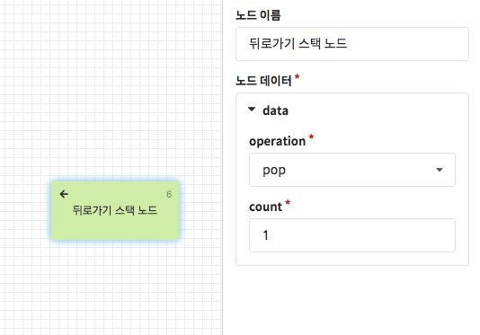
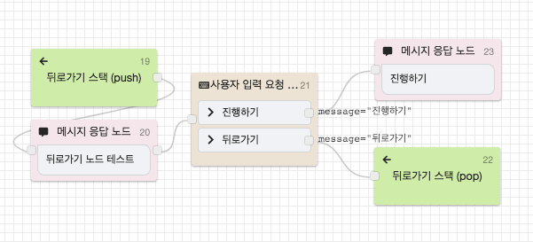
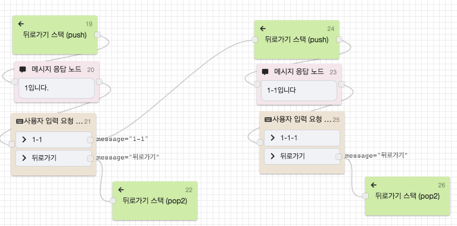

# 뒤로가기 스택 노드👩🏻‍🔬

뒤로가기 스택 노드는 **돌아갈 지점\(노드의 위치\)을 기록**하거나 **기록된 위치로 돌아가는 역할**을 수행하는 노드입니다. 

CLOSER에서 뒤로가기 기능을 구현하기 위해서는 **뒤로가기 스택**을 직접 관리하여야 합니다. 이를 이해하기 위해서는 우선 스택\(Stack\)을 먼저 이해하셔야 하는데, 스택에 대한 설명은 아래 블로그를 참고해 주세요. 

* \(국문\) [https://rimi-rimi.tistory.com/1](https://rimi-rimi.tistory.com/1) - 자료구조 STACK\(스택\) 쉽게 이해하기

* **`push`**: 뒤로가기 스택에 현재 위치를 저장
* **`pop`**: 뒤로가기 스택에서 저장된 위치들을 `count`갯수만큼 꺼낸 이후 마지막 꺼낸 위치로 이동
* **`clear`**: 스택을 초기화. \(폴백 플로우나 진입 플로우로 복귀했을 때 주로 사용합니다.\)


**스택에 존재하는 값보다 더 많은 수를 pop count로 지정한 경우,** 챗봇은 가장 처음에 저장된 위치가 아닌 폴백 플로우로 이동합니다.


이제 뒤로가기 스택 노드의 사용법을 실제 예제와 함께 알아보도록 합시다.

## 사용 예제

19번 노드에서 현재 위치를 뒤로가기 스택에 저장\(push\)하였고, 사용자가 21번 노드에서 \[뒤로가기\]를 선택하게 되면 22번 노드에서 저장된 위치로 이동\(pop, 1\)하게 됩니다. 여기서 뒤로가기를 선택하면 챗봇은 계속해서 "뒤로가기 노드 테스트"라는 응답을 반환하게 됩니다.

하지만 위 동작은 의도한 동작이 아닐 가능성이 높습니다. 이제 뒤로가기 기능을 더 자연스럽게 구현하는 법을 알아보겠습니다.

위 시나리오에서는 뒤로가기를 선택 시 `pop`을 2번 수행하도록 작성하였습니다. 이 때, 21번 노드에서 \[1-1\]을 선택하고 25번 노드에서 \[뒤로가기\]를 선택하게 되면 26번 노드에서 24번 노드의 위치로 돌아가는 것이 아닌 19번 노드의 위치로 돌아가게 됩니다. \(pop을 2번 수행하였기 때문\) 

pop을 2번 수행하는 이 동작의 원리를 이해하셨다면, 챗봇에서 원하는 지점으로 뒤로가기 네비게이션을 다루는 방법을 터득하셨을 거에요. 잘 모르시겠다면 실제로 위와 같은 노드들을 작성하셔서 실제 동작을 확인하며 테스트 해 보세요!

